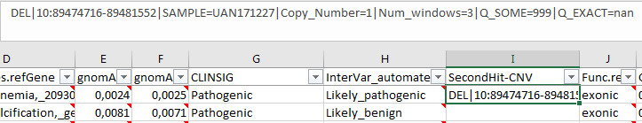
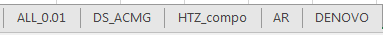
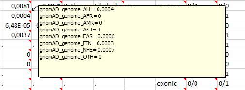
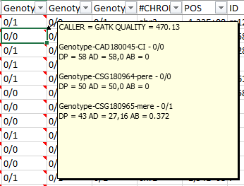
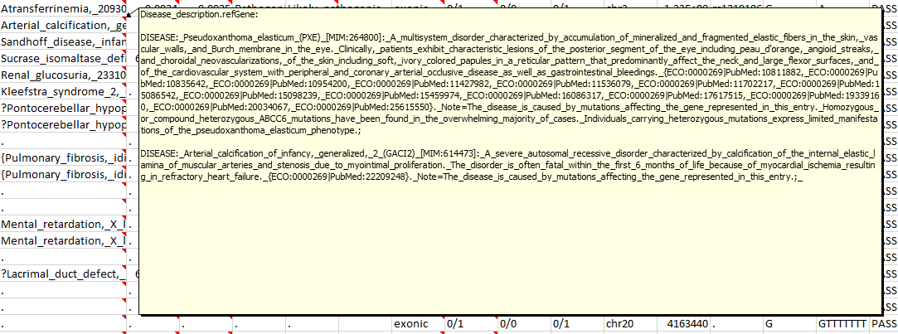
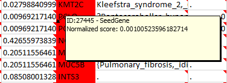
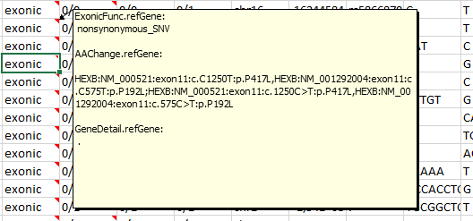

# Captain ACHAB | Analysis Converter for Human who might Abhor Bioinformatics
--------------------------------------------------------------------------------


## Overview

Captain ACHAB is a simple and useful interface to analysis of NGS data for molecular diagnosis.
This is the end of Excel table with so many columns ! All necessary information is available in one look.
Captain ACHAB file are readable with Excel (.xlsx) ( or soon with the open-source [CuteVariant](https://github.com/labsquare/CuteVariant) (.JSON)).     
   


### Main features

- **Single window interpretation** : All needed informations for variants biological interpretation are accessible (Quality data, genotype, variant localization, general population frequency, in silico splice and missense predictions, clinical human disease association ...) with multi-dimensional display (colors, on hover commentary). 

- **Ranked and prioritized variants** : Variants are sorted and ranked by the [MoBiDiC Prioritization Algorithm](https://github.com/mobidic/MPA/) with additional ranking rules depending gene knowledge (Gnomad [LOEUF](https://www.biorxiv.org/content/biorxiv/early/2019/01/30/531210.full.pdf) ) and phenotypes (HPO and [Phenolyzer](https://github.com/WGLab/phenolyzer)).   

- **Mode of inheritance** : Multiples sheets are created depending on assumed mode of inheritance (Autosomal recessive, Autosomal Dominant, Compound Heterozygous, de novo with the --trio option).

- **Selection of gene panels** : --candidates option create a specific sheet with your genes of interests. 

- **CNV implementation** : --cnvGeneList option let you add CNV list from your CNV caller into Captain Achab. We recommand to use [MoLLuDiC](https://github.com/mobidic/MoLLuDiC/) or [MobiCNV](https://github.com/mobidic/MobiDL) for CNV calling with a output ready for Captain Achab.  


## Biological interpretation with Captain Achab

To be notice : More informations are available when mouse is hovering over the cell, if a right top red triangle is displayed. 

**1. Select your mode of inheritance hypothesis by selecting the right sheet :**  



**2. Filter variant depending on general population frequency :**  

Default frequency threshold is 0.01 in gnomAD_genome (1%).


**3. Analyse variants from top to bottom via the MPA-achab ranking :** 

According to MPA >= v1.1.0  Ranking : from 1 to 9 and score.  


- 1   clinvar_pathogenicity : Pathogenic variants reported on ClinVar (score : 10) 
- 2   stop or frameshift_impact : Premature Truncation Codon : nonsense or frameshift (score : 10)
- 3   splicing_impact (ADA, RF) : Affecting splice variants predictions ranked by algorithm performance robustness and strength (score : 10)
- 4   splicing_impact (spliceAI high) : Affecting splice variants predictions ranked by algorithm performance robustness and strength (score : 10)
- 5   missense impact moderate to high impact (6-10)
- 6   moderate splicing_impact (spliceAI moderate) (score 6)
- 7   missense_impact moderate : Missense variants scores low impact (score : 2-6)
- 8   low splicing impact (spliceAI low) (indel) (score : 2)
- 9   missense_impact low : Missense variants scores low impact (score : 0-2)
- 10  unknown impact : Exonic variants with not clearly annotated ORFs and splicing variants not predicted pathogenic ; or NULL (no annotation on genes, splice etc...) (score : 0-10) (put in new Hope output file)


**4. Analysis first variants with good coverage :**  

DP stand for Depth   
AB for Allele Balancy  
AD for Allele Depth (ref and alt)  
By default, cell is pink if AB is beneath 20% (0.2) and becomes purple when alt AD is under 5.  


**5. Diagnosis analysis :**   

- Selection of OMIM morbid gene only    
Filter emptys cells "." in the Phenotypes.refGene column.   


- [Intervar](https://github.com/WGLab/InterVar) automatic and pre-computed advice on ACMG classification.    


**6. Research analysis :**   

Select candidate gene by in silico predictions (LOEUF, missense score), tissue specificity and gene function.  


Select candidate gene by Phenolyzer predictions  



**7. HGVS classification for NGS report :**

Find variant nomenclature for all transcripts from RefSeq (NM).  


## How to get a Captain Achab file

### Input 

Captain ACHAB need a vcf annotated by ANNOVAR with MPA annotations and Phenolyzer predictions. 
See [MoBiDiC Prioritization Algorithm](https://github.com/mobidic/MPA/) and [Phenolyzer](https://github.com/WGLab/phenolyzer).

### Use Captain Achab via a Singularity Container from a raw vcf file

We create a Singularity container to use Captain Achab workflow easier. All details are available at the repository [Achabilarity](https://github.com/mobidic/Achabilarity).

### Get all requirements to get a vcf file ready for Captain Achab

#### 1. Get custom annotations

To get unavailable annotations in ANNOVAR database into our vcf, we strongly recommend to use [AddDB_updater](https://github.com/mobidic/AddDB_updater) to add LOEUF score, OMIM database and up-to-date clinvar data into the gene_fullxref.txt from ANNOVAR available in the example folder.


#### 2. Annovar annotation 

A tutorial to install ANNOVAR and more informations are available at : [MoBiDiC Prioritization Algorithm](https://github.com/mobidic/MPA/)

Command line for vcf annotation by ANNOVAR with needed databases. 

```bash
perl path/to/table_annovar.pl path/to/example.vcf humandb/ -buildver hg19 -out path/to/output/name -remove -protocol refGene,refGene,clinvar_20170905,dbnsfp33a,spidex,dbscsnv11,gnomad_exome,gnomad_genome,intervar_20180118 -operation gx,g,f,f,f,f,f,f,f -nastring . -vcfinput -otherinfo -arg '-splicing 20','-hgvs',,,,,,, -xref example/gene_customfullxref.txt
```

#### 3. MPA annotation

See installation and more informations about MPA at [MoBiDiC Prioritization Algorithm](https://github.com/mobidic/MPA/).

```bash
git clone https://github.com/mobidic/MPA.git
```

Command line for annotated vcf by ANNOVAR with MPA scores.

```bash
python MPA.py -i name.hg19_multianno.vcf -o name.hg19_multianno_MPA.vcf
```

#### 4. Phenolyzer annotation 

Tutorial to install Phenolyzer is available at [Phenolyzer](https://github.com/WGLab/phenolyzer). 

Installation (need Bioperl and Graph, easy to install with cpanm)
```bash
git clone https://github.com/WGLab/phenolyzer
```

Create a disease file where you can add your HPO phenotypes (one line per phenotype).

```bash
vim disease.txt
```

Command line to get predictions for Phenolyzer and the out.predicted_gene_scores.

```bash
perl disease_annotation.pl disease.txt -f -p -ph -logistic -out disease/out
```

#### 4. Library used

Python library : pandas and dependencies (only tested with python 2.7)

Perl library via cpanm : BioPerl, Graph, Switch, Excel::Writer::XLSX


### Captain ACHAB Command

```bash
https://github.com/mobidic/Captain-ACHAB.git
```

Command line to use Captain ACHAB 

```
#USAGE : perl achab.pl 
                        --vcf <vcf_file> (mandatory)
                        --outDir <output directory (default = current dir)>
                        --outPrefix <output file prelifx (default = "")>
                        --candidates <file with end-of-line separated gene symbols of interest (it will create more tabs, if "#myPathology" is present in the file, a myPathology tab will be created)>  
                        --phenolyzerFile <phenolyzer output file suffixed by predicted_gene_scores (it will contribute to the final ranking and top50 genes will be added in METADATA tab)>   
                        --popFreqThr <allelic frequency threshold from 0 to 1 default=0.01 (based on gnomad_genome_ALL)> 
                        --trio (requires case dad and mum option to be filled, but if case dad and mum option are filled, trio mode is automatically activated ) 
                          --case <index_sample_name> (required with trio option)
                          --dad <father_sample_name> (required with trio option)
                          --mum <mother_sample_name>  (required with trio option)
                        --customInfoList  <comma separated list of vcf annotation INFO name (each of them will be added in a new column)> 
                        --filterList <comma separated list of VCF FILTER to output (default= 'PASS', included automatically to the list)>
                        --cnvGeneList <file with gene symbol + annotation (1 tab-separated), involved by parallel CNV calling>
                        --customVCF <VCF format File with custom annotation (if variant matches then INFO field annotations will be added in new column)>
                        --mozaicRate <mozaic rate value from 0 to 1, it will color 0/1 genotype according to this value  (default=0.2 as 20%)>
                        --mozaicDP <ALT variant Depth, number of read supporting ALT, it will give darker color to the 0/1 genotype  (default=5)>
                        --newHope (only popFreqThr filter is applied (no more filterList nor MPA_ranking filtering)
                        --affected <comma separated list of samples affected by phenotype (assuming they support the same genotype) >
                        --favouriteGeneRef <File with transcript references to extract in a new column (1 transcript by line) >
                        --filterCustomVCF <integer value, penalizes variant if its frequency in the customVCF is greater than [value] (default key of info field : found=[value])  >
                        --filterCustomVCFRegex <string pattern used as regex to search for a specific field to filter customVCF (default key of info field: 'found=')  >
                        --pooledSamples <comma separated list of samples that are pooled (it will convert 0/0 genotype into 0/1 if at least 1 read support ALT base, e.g. parents pool in trio context)  >
                        --sampleSubset <comma separated list of samples only processed by Achab to the output>
                        --addCaseDepth (case Depth will be added in a new column) 
                        --intersectVCF <VCF format File for comparison (if variant matches then 'yes' will be added in a new 'intersectVCF' column) >
                        --poorCoverageFile <poor Coverage File (it will annotate OMIM genes if present in 4th column -requires OMIM genemap2 File- and create an excel file )>
                        --genemap2File <OMIM genemap2 file (it will help to annotate OMIM genes in poor coverage file )> 
                        --help (print this command usage)


```

## Troubleshooting

### Clean VCF if Platypus caller is used.

Remove line with discording field from Platypus caller.  

```bash
awk -F "\t|:" '{if($5~/,.+,.+/ && $0 ~ /GT:GOF:GQ:NR:NV:PL/){na=split($5,a,",");nb=split($NF,b,",");if(nb > 8){print $0 }}else{print}}' sample.vcf > sample.clean.vcf
```
### Multiallelic lines

Multiallelic lines from vcf have to be split before annotation.

```bash
sort example.vcf 
bcftools-1.3.1/htslib-1.3.1/bgzip -i example.sort.vcf
bcftools-1.3.1/bcftools norm -O v -m - -o example.norm.vcf example.sort.vcf.gz
```

### Clean whitespace in VCF
No whitespace is allowed in VCF ready to Captain Achab. Replace them with underscores.

```bash
sed -i 's/ /_/g' example.vcf 
```

### Contig in VCF missing
Contig is necessary in VCF header.

### Create db.vcf input for Captain Achab
If you doesn't have database of your variant, you can create a db.vcf with all of your vcfs and Captain ACHAB will tell you how many times the variants is found & in which sample.

Put all your vcf in one folder.
Use GATK Combine Variant to merge all VCF.

Create a vcfmerge.sh file :
```bash
java -jar GenomeAnalysisTK.jar -T CombineVariants -R hg19.fa -o all.vcf -genotypeMergeOptions UNIQUIFY -minN 2 \ 
```
Add to the script all VCF :
```bash
for i in *.vcf; do echo --variant $i \\ >> vcfmerge.sh ; done
```
Run vcfmerge.sh. Then run the vcf-sample-counter.sh and you'll get the db.vcf.

#### Optional : 
If needed, you can "clean" the all.vcf with this command :

```bash
awk -F "\t" 'BEGIN{OFS="\t"}{if($1!~/^#/){$8="AN=10"}print}' all.vcf > all_clean.vcf
```

If needed, you may need to bcftools LeftAlign and bcftools Split the all_clean.vcf.


--------------------------------------------------------------------------------

**Montpellier Bioinformatique pour le Diagnostic Clinique (MoBiDiC)**

*CHU de Montpellier*

France


[Visit our website](https://neuro-2.iurc.montp.inserm.fr/mobidic/)

--------------------------------------------------------------------------------
