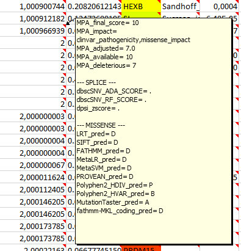

# Captain ACHAB | Analysis Converter for Human who might Abhor Bioinformatics
--------------------------------------------------------------------------------


## Overview

Captain ACHAB is a simple and useful interface to analysis of NGS data for molecular diagnosis.
This is the end of Excel table with so many columns ! All necessary information is available in one look.
Captain ACHAB file are readable with Excel (.xlsx) or with the open-source [CuteVariant](https://github.com/labsquare/CuteVariant) (.JSON). 

### Main features

- **Single window interpretation** : All needed informations for variants biological interpretation are accessible (Quality data, genotype, variant localization, general population frequency, in silico splice and missense predictions, clinical human disease association ...) with multi-dimensional display (colors, on hover commentary). 

- **Ranked and prioritized variants** : Variants are sorted and ranked by the [MoBiDiC Prioritization Algorithm](https://github.com/mobidic/MPA/) with additional ranking rules depending gene knowledge (pLI) and phenotypes (HPO and [Phenolyzer](https://github.com/WGLab/phenolyzer)).   

- **Mode of inheritance** : Multiples sheets are created depending on assumed mode of inheritance (Autosomal recessive, Autosomal Dominant, Compound Heterozygous, de novo with the --trio option).

- **Selection of gene panels** : --candidates option create a specific sheet with your gene of interests. 

- **CNV implementation** : --cnvGeneList option let you add CNV list from your CNV caller into Captain Achab. We recommand to use [MoLLuDiC](https://github.com/mobidic/MoLLuDiC/) or [MobiCNV](https://github.com/mobidic/MobiDL) for CNV calling with a output ready for Captain Achab. 

### Biological interpretation with Captain Achab

To be notice : More informations are available when mouse is hovering over the cell, if a right top red triangle is displayed. 

**1. Select your mode of inheritance hypothesis by selecting the right sheet :**  


**2. Analyse variants from top to bottom via the MPA-achab ranking :**    
Ranking : from 1 to 7 and score.  
Numbers after comma represents adjustment depending on in silico gene predictions pLi, pRec, missense Z-score.  
- 1 - 10 with clinvar_pathogenicity : Pathogenic variants reported on ClinVar
- 2 - 10 with stop or frameshift_impact : Premature Truncation Codon : nonsense or frameshift
- 3,4,5 - 10 with splicing_impact (ADA, RF, Spidex) : Affecting splice variants predictions ranked by algorithm performance robustness
- 6 - with splicing_impact (indel) - Indel in splicing regions (as there is no splicing predictions for this case)
- 7 - with missense_impact (10 to 0) : Missense variants scores
- 8 - with unknown_impact : Exonic variants with not clearly annotated ORFs and splicing variants not predicted pathogenic  



**3. Filter variant depending on general population frequency : 


**4. Diagnosis analysis : selection of OMIM morbid gene only** 
Filter emptys cells "." in the Phenotypes.refGene column. 


**5. Diagnosis analysis : ** 


## How to get a Captain Achab file

### Input 

Captain ACHAB need a vcf annotated by ANNOVAR with MPA annotations and Phenolyzer predictions. 
See [MoBiDiC Prioritization Algorithm](https://github.com/mobidic/MPA/) and [Phenolyzer](https://github.com/WGLab/phenolyzer).

### Use Captain Achab via a Singularity Container from a raw vcf file

We create a Singularity container to use Captain Achab workflow easier. All details are available at the repository [Achabilarity](https://github.com/mobidic/Achabilarity).

### Get all requirements to get a vcf file ready for Captain Achab

#### 1. Get custom annotations

To get unavailable annotations in ANNOVAR database into our vcf, we are going to add missense Z-score from ExAC and OMIM database into the gene_fullxref.txt from ANNOVAR available in the example folder.

##### Missense Z-score 

First download the database from ExAc (ftp.broadinstitute.org).

```bash
wget ftp://ftp.broadinstitute.org/pub/ExAC_release/release0.3.1/functional_gene_constraint/fordist_cleaned_exac_r03_march16_z_pli_rec_null_data.txt
```
Choose only columns neededs and reduce decimal to 3 numbers.

```bash
cut -f2,18 fordist_cleaned_exac_r03_march16_z_pli_rec_null_data.txt |  awk -F "\t" '{printf("%s,%.3f\n",$1,$2)}' | sed s/,/"\t"/g > missense_zscore.txt 
vim missense_zscore.txt ## change header "gene" to "#Gene_name" and name column 2 "Missense_Z_score" to allow recognition by pandas
```

##### OMIM 

According to use OMIM license, download the gene2map.txt at https://www.omim.org/downloads/.

```bash
tail -n+4 genemap2.txt | cut -f 9,13 > omim.tsv
vim omim.tsv ## change header "Approved Symbol" to "#Gene_name" to allow recognition by pandas
```

##### Merge with the gene_fullxref.txt

You need first to install pandas if needed.

```bash
pip install pandas
```
Use the merge function from pandas module to merge gene_fullxref.txt with OMIM and missense Z-score annotations. 

```python
import pandas

fullxref = pandas.read_table('gene_fullxref.txt') 
omim = pandas.read_table('omim.tsv')
zscore = pandas.read_table('missense_zscore.txt')

merge = pandas.merge(fullxref,omim, on="#Gene_name", how="left", left_index=True)
mergeFinal = pandas.merge(merge,zscore, on="#Gene_name", how="left", left_index=True)

mergeFinal.to_csv('gene_customfullxref_tmp.txt',sep='\t')
```

Cut the first column created by pandas and the gene_customfullxref.txt is ready to be use in ANNOVAR. sed and awk command are used to replace some characters not compatible for regex in ANNOVAR. Last awk command fill the empty cells with a point.

```bash
cut -f2- gene_customfullxref_tmp.txt | sed 's/+/plus/g' | awk 'BEGIN{FS=OFS="\t"} {for (i=6;i<=7;i++) gsub(/-/,"_",$i)}1' |  awk 'BEGIN{FS=OFS="\t"} {gsub(/-/,"_",$(NF-1))}1' | sed 's/(congenital with brain and eye anomalies,/(congenital with brain and eye anomalies),/g' | sed 's/s-/s_/g' | awk -F"\t" -v OFS="\t" '{for (i=1;i<=NF;i++) {if ($i == "") $i="."} print $0}' > gene_customfullxref.txt
rm gene_customfullxref_tmp.txt 
```

#### 2. Annovar annotation 

A tutorial to install ANNOVAR and more informations are available at : [MoBiDiC Prioritization Algorithm](https://github.com/mobidic/MPA/)

Command line for vcf annotation by ANNOVAR with needed databases. 

```bash
perl path/to/table_annovar.pl path/to/example.vcf humandb/ -buildver hg19 -out path/to/output/name -remove -protocol refGene,refGene,clinvar_20170905,dbnsfp33a,spidex,dbscsnv11,gnomad_exome,gnomad_genome,intervar_20180118 -operation gx,g,f,f,f,f,f,f,f -nastring . -vcfinput -otherinfo -arg '-splicing 20','-hgvs',,,,,,, -xref example/gene_customfullxref.txt
```

#### 3. MPA annotation

See installation and more informations about MPA at [MoBiDiC Prioritization Algorithm](https://github.com/mobidic/MPA/).

```bash
git clone https://github.com/mobidic/MPA.git
```

Command line for annotated vcf by ANNOVAR with MPA scores.

```bash
python MPA.py -i name.hg19_multianno.vcf -o name.hg19_multianno_MPA.vcf
```

#### 4. Phenolyzer annotation 

Tutorial to install Phenolyzer is available at [Phenolyzer](https://github.com/WGLab/phenolyzer). 

Installation (need Bioperl and Graph, easy to install with cpanm)
```bash
git clone https://github.com/WGLab/phenolyzer
```

Create a disease file where you can add your HPO phenotypes (one line per phenotype).

```bash
vim disease.txt
```

Command line to get predictions for Phenolyzer and the out.predicted_gene_scores.

```bash
perl disease_annotation.pl disease.txt -f -p -ph -logistic -out disease/out
```

#### 4. Library used

Python library : pandas and dependencies (only tested with python 2.7)

Perl library via cpanm : BioPerl, Graph, Switch, Excel::Writer::XLSX


### Captain ACHAB Command

```bash
https://github.com/mobidic/Captain-ACHAB.git
```

Command line to use Captain ACHAB 

```
#USAGE : perl achab.pl 
                        --vcf <vcf_file> 
                        --outDir <output directory (default = current dir)> 
                        --candidates <file with gene symbol of interest>  
                        --phenolyzerFile <phenolyzer output file suffixed by predicted_gene_scores>   
                        --popFreqThr <allelic frequency threshold from 0 to 1 default=0.01> 
                        --trio (requires case dad and mum option to be filled) 
                          --case <index_sample_name> (required with trio option)
                          --dad <father_sample_name> (required with trio option)
                          --mum <mother_sample_name>  (required with trio option)
                        --customInfoList  <comma separated list of vcf-info name (will be added in a new column)> 
                        --filterList <comma separated list of VCF FILTER to output (default= 'PASS', included automatically to the list)>
                        --cnvGeneList <file with gene symbol + annotation (1 tab-separated), involved by parallel CNV calling>
                        --customVCF <VCF format File with custom annotation (if variant matches then INFO field annotations will be added in new column)>
                        --mozaicRate <mozaic rate value from 0 to 1, it will color 0/1 genotype according to this value  (default=0.2 as 20%)>
                        --mozaicDP <ALT variant Depth, number of read supporting ALT, it will give darker color to the 0/1 genotype  (default=5)>
                        --newHope (output only NON PASS+ NON filterList or MPA_rank = 8 variants, default=output FILTER=PASS+filterList and MPAranking < 8 variants )>
                        --help (print this command usage)

```

## Troubleshooting

### Clean VCF if Platypus caller is used.

Remove line with discording field from Platypus caller.  

```bash
awk -F "\t|:" '{if($5~/,.+,.+/ && $0 ~ /GT:GOF:GQ:NR:NV:PL/){na=split($5,a,",");nb=split($NF,b,",");if(nb > 8){print $0 }}else{print}}' sample.vcf > sample.clean.vcf
```
### Multiallelic lines

Multiallelic lines from vcf have to be split before annotation.

```bash
sort example.vcf 
bcftools-1.3.1/htslib-1.3.1/bgzip -i example.sort.vcf
bcftools-1.3.1/bcftools norm -O v -m - -o example.norm.vcf example.sort.vcf.gz
```

--------------------------------------------------------------------------------

**Montpellier Bioinformatique pour le Diagnostique Clinique (MoBiDiC)**

*CHU de Montpellier*

France


[Visit our website](https://neuro-2.iurc.montp.inserm.fr/mobidic/)

--------------------------------------------------------------------------------
